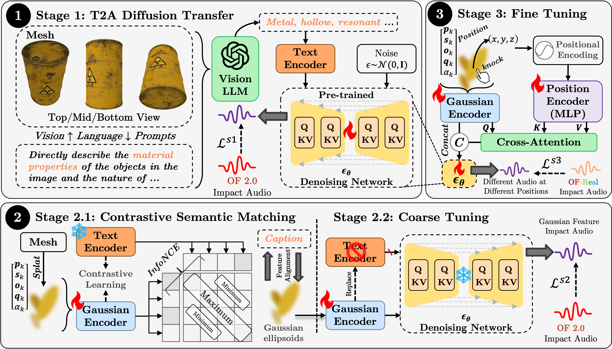

<div align="center">

# SonicGauss

### Síntesis de Sonido Físico Consciente de la Posición para Representaciones Gaussianas 3D

<p align="center">
  <a href="https://chunshi.wang/SonicGauss/"></a>
  <a href="https://dl.acm.org/doi/10.1145/3746027.3755035"></a>
</p>

<p align="center">
  <strong>Chunshi Wang</strong>, <strong>Hongxing Li</strong>, <strong>Yawei Luo</strong>
  <br>
  <em>Zhejiang University</em>
</p>

</div>

---

## Visión General

**SonicGauss** es un marco de trabajo novedoso para sintetizar **sonidos de impacto** a partir de representaciones de 3D Gaussian Splatting (3DGS), aprovechando sus propiedades geométricas y materiales inherentes.

<p align="center">
  
</p>

---

## Primeros Pasos

### Requisitos Previos

```bash
# Clone the repository with submodules
git clone https://github.com/AiEson/SonicGauss.git --recursive

cd SonicGauss

# Create conda environment
conda create -n sonicgauss python=3.10
conda activate sonicgauss
```

```txt
Please install the requirements for the following repositories: 
- TangoFlux: https://github.com/declare-lab/TangoFlux.git
- SplatFormer: https://github.com/ChenYutongTHU/SplatFormer.git
```

---

## Conjunto de Datos

Entrenamos y evaluamos utilizando el conjunto de datos [ObjectFolder](https://objectfolder.stanford.edu/):

- **ObjectFolder 2.0**: 1,000 objetos con sonidos de impacto sintéticos
- **ObjectFolder Real**: Grabaciones del mundo real con diversos materiales

### Descarga del Conjunto de Datos

**Para instrucciones detalladas de descarga, consulte [datas/README.md](datas/README.md)**

El conjunto de datos incluye:
- Conjuntos de datos ObjectFolder 2.0 y ObjectFolder Real
- Archivos PLY de 3DGS
- Imágenes renderizadas
- Grabaciones de sonidos de impacto
- Archivos de división de entrenamiento/validación

**Tamaño Total**: ~24.7 GB

---

## Modelos Preentrenados

**Para instrucciones de descarga de modelos, consulte [ckpts/README.md](ckpts/README.md)**

**Tamaño Total**: ~3.5 GB

---

## Entrenamiento

### Etapa 1: Preentrenamiento de Texto a Audio

```bash
bash stage1/train.sh
```

### Etapa 2: Aprendizaje de Gaussiano a Audio

```bash
bash stage2/train_2_1.sh
bash stage2/train_2_2.sh
```

### Etapa 3: Ajuste Fino Consciente de la Posición

```bash
bash stage3/train_3.sh
```

---

## Inferencia

Genere sonidos de impacto a partir de una representación 3DGS:

```python
from stage3.infer_3 import Stage3Inference

# Initialize model
model = Stage3Inference(
    model_path="./ckpts/stage3/best",
    config_path="./configs/stage3.yaml",
    device="cuda"
)

# Generate audio
audio = model.generate(
    ply_path="path/to/object.ply",
    position=[0.1, 0.2, 0.3],  # Impact position (x, y, z)
    duration=3.0,              # Audio duration in seconds
    steps=50,                  # Diffusion steps
    seed=42
)

# Save audio
import torchaudio
torchaudio.save("output.wav", audio, 44100)
```

### Inferencia con entrada JSON

```bash
python stage3/infer_3.py
```

Luego, los archivos de audio generados se pueden encontrar en el directorio `generated/stage3`.


## Evaluación

Evaluamos utilizando métricas estándar de generación de audio:

```bash
cd stage3
python eval.py
```

---

## Estructura del Proyecto

```
SonicGauss/
├── configs/                 # Archivos de configuración
│   ├── stage1.yaml
│   ├── stage2.yaml
│   └── stage3.yaml
├── stage1/                  # Preentrenamiento de Texto a Audio
├── stage2/                  # Aprendizaje de Gaussiano a Audio
│   ├── train_2_1.py        # Aprendizaje contrastivo
│   ├── train_2_2.py        # Entrenamiento generativo
│   └── common.py           # Utilidades compartidas
├── stage3/                  # Ajuste fino consciente de la posición
│   ├── train_3.py          # Script de entrenamiento
│   ├── infer_3.py          # Script de inferencia
│   ├── eval.py             # Script de evaluación
│   └── common.py           # Codificador de posición y fusión
├── SplatFormer/            # Backbone PTv3 (submódulo)
├── TangoFlux/              # Modelo de difusión (submódulo)
├── audioldm_eval/          # Kit de evaluación de audio (submódulo)
├── datas/                  # Archivos del conjunto de datos
├── ckpts/                # Puntos de control de entrenamiento
└── assets/                 # Imágenes y recursos
```

---

## Citación

Si encuentra este trabajo útil, por favor cite nuestro artículo:

```bibtex
@inproceedings{wang2025sonicgauss,
  title={SonicGauss: Position-Aware Physical Sound Synthesis for 3D Gaussian Representations},
  author={Wang, Chunshi and Li, Hongxing and Luo, Yawei},
  booktitle={Proceedings of the 33rd ACM International Conference on Multimedia},
  pages={10886--10895},
  year={2025}
}
```

---

## Agradecimientos

Agradecemos a los autores de los siguientes proyectos por su excelente trabajo:

- **[ObjectFolder](https://objectfolder.stanford.edu/)** - Conjunto de datos multimodal de objetos con sonidos de impacto
- **[TangoFlux](https://github.com/declare-lab/TangoFlux)** - Modelo de difusión de texto a audio
- **[SplatFormer](https://github.com/ChenYutongTHU/SplatFormer)** - Extracción de características 3DGS con PointTransformer
- **[audioldm_eval](https://github.com/haoheliu/audioldm_eval)** - Kit de evaluación de generación de audio

---

<div align="center">

**[🌐 Página del Proyecto](https://chunshi.wang/SonicGauss/)** · **[📄 Artículo](https://dl.acm.org/doi/10.1145/3664647.3681603)** · **[🐛 Problemas](https://github.com/AiEson/SonicGauss/issues)**

</div>
